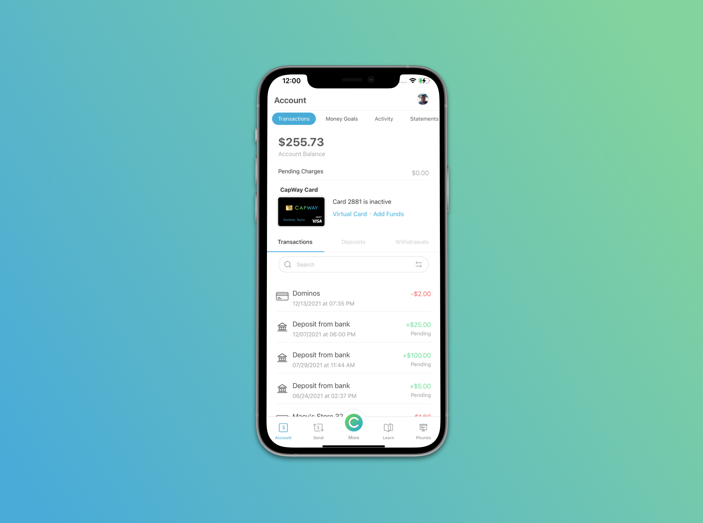

# CapWay Interview (Android)
Referencing the designs below, create an Android application that shows general account details with a few transactions.

## Design Preview

This screen can also be found within our app in the app store: 

https://play.google.com/store/apps/details?id=com.tbox.capway&hl=en_US&gl=US

## Requirements

- Fork this repo before making any changes
- Frequently commit your changes to GIT, with proper messages on each commit.
- Colors should be the same hex/rgb values that appear within the screenshots
- Code should be well documented, with adequate comments explaining relevant sections.
- Designs should scale down to at least iPhone 5 (preferrably using AutoLayout)
- Assets can be found within the assets folder of this repo
- Search does not need to work
- Tapping on the options within the tab menu only needs to change the view to an empty white screen
- Pre-populate the screen with at least 10 transactions
- Use any transaction category icon beside each transaction 

### BONUS:
- Make top sliding navigation work in such a way that tapping on the menu options changes the screen to a white UIView
- Make it so that scrolling to the very bottom of the screens adds another 10 transactions

## Submitting
If you have any questions about the tech or design specifications or have submitted your application, please email dondrey@capway.com.

## Interaction Preview

The following demonstrates how the interactions pertaining to this coding challenge work when using the screen on a device. 

